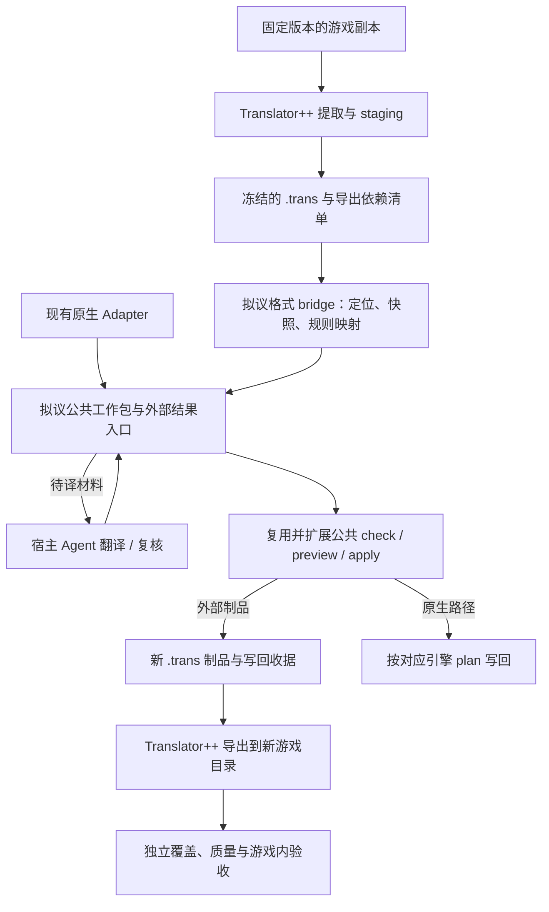

# Translator++ 多引擎接入评估

> **状态**：研究与接入设计，未实现 Translator++ bridge，未执行真实往返实验；不是安装或使用手册。
> **核对日期与基线**：2026-09-16；本仓库 `main@f5cec70`、GitHub issue 正文及最新状态评论、Translator++ 官方文档与发行说明。
> **关联**：[#272](https://github.com/hu-border-collie/renpy-translation-lab/issues/272)、[多引擎能力矩阵](visual_novel_localization_matrix.md)、[生态研究](multi_engine_localization_ecosystem_research.md)。
> **排期边界**：本文补充外部工具路线，不解除 #272 的暂缓决定，不把其他引擎标为已支持，也不扩大 [Agent 工具包提案 PR #499](https://github.com/hu-border-collie/renpy-translation-lab/pull/499) 的首轮 Ren'Py 实验范围。

## 1. 结论与帮助范围

**Translator++ 可以充当可选的外部格式适配后端，最有希望节省的是特定引擎的解包、文本提取和游戏格式导出工作。** 本项目仍需负责导入制品的身份、上下文映射、结果完整性、冲突与过期检测、结构规则、受控写回，以及独立的游戏验收。

推荐先验证 **一个固定版本的 RPG Maker 叙事工程，经 `.trans` 文件交换完成往返**。文件 bridge 通过后再评估 MCP 自动化。Naninovel 仍保留为原生 Adapter 首选；是否开发 bridge，应由实验中的净收益决定。

目前不能给出“节省百分之多少开发量”或“几百行换来所有引擎支持”的可信估算。不同 parser 的支持窗口、上下文粒度与导出依赖差异很大，尚无本仓库实测数据。

| 工作层 | 潜在帮助 | 仍需承担的工作 |
| --- | --- | --- |
| 游戏格式识别、解包、提取、重新封装 | **高，但按 parser 和版本验收** | 输入可用性、插件方言、遗漏范围与输出可运行性验证 |
| 统一文本交换 | **中到高**：`.trans` 可作为现成交换制品 | 网格行与真实 occurrence 的映射、有效译文列、上下文译文及未知字段保留 |
| 人工浏览、编辑、复核 | **中**：可利用现有网格界面 | 与本项目 identity、review decision、proposal 及 freshness 的双向衔接 |
| 模型调用、Batch、多供应商 | **有能力重叠，新增收益待比较** | 本项目路由、恢复、真实用量与既有 Provider 验收不会自动完成 |
| 快照、结果归属、结构检查、安全写回 | **已有本项目机制可复用；接入工作仍明显** | 将 `.trans`、源引擎规则、导出依赖纳入公共合同，不能只增加一个 reader |
| 全游戏 coverage、剧情质量、字体和可玩性 | **辅助证据** | 独立覆盖基准、译文质量抽样、字体/排版及游戏内验证 |

这里的“多引擎”不等于本工具获得跨操作系统能力。官网公开下载仍列 Windows 版本；桥接还会引入本地安装、版本固定及升级回归成本。[官方下载页](https://dreamsavior.net/download/)

## 2. 证据与不确定性

本文使用四类证据：`[官方]` 为上游发布的能力或格式；`[仓库]` 为上述基线可直接核对的实现；`[推断]` 为据此提出的接入判断；`[待实测]` 为必须用指定版本和 fixture 验证的行为。官方宣称支持某引擎，不等于本项目已验证该引擎。

### 2.1 已确认的上游接口

| 证据 | 核对结果与接入含义 |
| --- | --- |
| `[官方]` [`.trans` 格式参考](https://dreamsavior.net/docs/translator-developers-guide/trans-format/format-reference/) | JSON 工程包含 `project.gameEngine`、`projectId`、`appVersion`、`cache` 和 `files`；`files[*].data` 是二维网格，示例允许 `null`；`context` 是逐行的上下文列表。参考页更新于 2023-05-11，不能视为 8.9.x 的完整 schema。 |
| `[官方]` [Context](https://dreamsavior.net/docs/translator/getting-started/context/) 与 [Translation by context](https://dreamsavior.net/docs/translator/getting-started/translation-by-context/) | context 的必需性和定位语义由 parser 决定；同一原文可能去重为一行并对应多个位置，也支持按上下文指定译文。不能假定“每行就是一句独立对白”。 |
| `[官方]` [Staging files](https://dreamsavior.net/docs/translator/staging-files/) 与 [工程备份](https://dreamsavior.net/docs/translator/faq/how-to-backup-a-project/) | 导出/注入依赖 staging；只保留 `.trans` 可能仍能编辑译文，却无法生成游戏补丁。`.tpp` 备份用于携带工程所需资源。 |
| `[官方]` [8.6.17 发行说明](https://dreamsavior.net/update-info-translator-ver-8-6-17/) | 已介绍 CLI Agent API、automation 管理及运行等能力，不能继续按“只能人工操作 GUI”评估。 |
| `[官方]` [8.9.2 发行说明](https://dreamsavior.net/update-info-translator-ver-8-9-2/) | Beta 版 Basic Utility API 0.21 增加 `/mcp` Streamable HTTP、初始化、工具发现/调用和结构化结果，并发布 Godot Parser 0.1。实际工具集与可用权限仍待本地发现。 |
| `[官方]` [8.9.9 发行说明](https://dreamsavior.net/update-info-translator-ver-8-9-9/) | Beta 版列出 RPG Maker MV/MZ Parser 2.21、Unity binary translator 0.1、RenParser 0.19、TyranoTrans 1.17。Unity 已不能仅用旧 XUnity 运行时捕获路线概括；这些版本也不证明 Naninovel 或 Dialogic 的特定格式可完整往返。 |
| `[官方]` [下载页](https://dreamsavior.net/download/) | 公共下载列为 8.4.15B，较新支持者/Developer 版本另有分发入口。实验必须记录实际取得的主程序、parser、add-on 版本，不能拿旧公共包推定具有新 MCP 能力。 |

Translator++ 已有 [LiteLLM add-on](https://dreamsavior.net/docs/add-on/litellm/) 和 [ChatGPT Translator Batch API](https://dreamsavior.net/docs/add-on/chatgpt-translator/batch-api/) 文档。本项目的价值需要由更少的返工、更可靠的结果管理或更好的译文证明，不能仅以“支持 LLM、多模型、Batch”作为差异。

### 2.2 源码、许可与尚未取得的证据

官方公开的 [Translator API 页面](https://dreamsavior.net/files/docs/tpp/Translator.html) 和 [trans.js 源码文档](https://dreamsavior.net/files/docs/tpp/trans.js.html) 提供接口/实现线索，并标注 GPL-3.0-or-later；这不证明当前 8.9.x 完整源码、所有 parser 与捆绑组件均可从同一公开仓库取得。下载页虽指向源码归档，本次未取得并审计与上述 Beta 版本匹配的完整源码包。

本仓库采用 [MIT 许可](../../LICENSE)。首版优先以独立程序和文件接口协作；若以后复制、修改或分发上游 parser，须逐组件核对实际源码、许可证及分发要求，不能根据产品名称统一判断。

当前未验证：最新 `.trans` 字段全集、有效译文列的实际选择规则、上下文译文存储布局、无 GUI 的运行条件、MCP 端口/认证/错误恢复、staging 完整依赖清单，以及任一第三引擎的真实导出结果。旧公开 `trans.js` 中存在从右侧取非空译文的逻辑，只能作为测试线索，不能当作当前版本合同。

## 3. 对当前 issues 和路线的影响

下表为 2026-09-16 状态快照。issue 的新评论可能修正正文中的旧记录；更新本文时应同时读取两者。

| 工作项与当前状态 | Translator++ 的作用与处理建议 |
| --- | --- |
| [#272 多引擎矩阵](https://github.com/hu-border-collie/renpy-translation-lab/issues/272)，open，第三 Adapter 实质复核/立项暂缓 | **直接影响较大**：增加“外部 parser + 公共工具核心”路线，降低部分引擎自行提取/导出的必要性。保留 Naninovel 原生首选与 RPG Maker 叙事 B+ 研究评级，不以本文勾选 P0/P1/P2 或恢复排期。 |
| [#265 Adapter](https://github.com/hu-border-collie/renpy-translation-lab/issues/265)、[#425 结构保护](https://github.com/hu-border-collie/renpy-translation-lab/issues/425)、[#422 写回事务](https://github.com/hu-border-collie/renpy-translation-lab/issues/422)，已关闭 | **复用基础**：接入 occurrence、snapshot、结构校验和写回事务。关闭状态证明原范围已交付，不证明第三引擎规则或 `.trans` 写回已存在。 |
| [PR #499 Agent 工具包提案](https://github.com/hu-border-collie/renpy-translation-lab/pull/499)，open，head `ed90d5c` | **接入方向最契合**：Agent 自主翻译，工具管理工作包、耐久结果和安全写回。共用外部结果合同；先保留该提案的 Ren'Py 首轮实验，再单独验证 Translator++ bridge。提案不等于已实现工具。 |
| [#431 直连 OpenAI-compatible](https://github.com/hu-border-collie/renpy-translation-lab/issues/431)，open | **不能替代**本项目协议后端、配置和 GUI 接线。宿主 Agent 产出译文的文件实验在技术上不依赖此后端，但不据此取消 #272 现有排期条件。 |
| [#344 Sync / 多 Provider](https://github.com/hu-border-collie/renpy-translation-lab/issues/344)，open | [9 月 15 日评论](https://github.com/hu-border-collie/renpy-translation-lab/issues/344#issuecomment-5682093066)已确认离线路由/状态暴露收口；余项是真实计费中断、Gemini smoke 和外部验收。Translator++ 不补这些证据；final_review 仍要求 `gemini_batch`，解绑另归 #431。 |
| [#488 预检摘要](https://github.com/hu-border-collie/renpy-translation-lab/issues/488)，open | bridge 将来应给现有预检提供制品范围、coverage 和 freshness，不能另建授权门禁。[字段合同](issue-488-preflight-summary-contract.md)已由 #498 合并；[PR #500](https://github.com/hu-border-collie/renpy-translation-lab/pull/500) 的 S1 核心实现仍 open（head `1cc3d99`），不能当作已发布。宿主 Agent 成本不可取得时为 unknown。 |
| [#427 普通译文审校](https://github.com/hu-border-collie/renpy-translation-lab/issues/427)，open | **可部分借用界面**，仍缺本项目的可重建索引、决定溯源、stale 和 proposal 衔接。Translator++ 编辑/审核标签不能直接等价为本项目写回许可。 |
| [#470 真实 Ren'Py coverage 样本](https://github.com/hu-border-collie/renpy-translation-lab/issues/470)，open | **可作差分提取对照**，不能替代授权样本与独立覆盖证据。去重行数、出现次数、源 `.rpy` 与 TL 范围不同，不能直接比较总行数并把任一方当真值。 |
| [#487 字形覆盖 spike](https://github.com/hu-border-collie/renpy-translation-lab/issues/487)，open | 字体替换能力不满足只读 `checked / missing / unknown` 检查；仍须区分静态字形覆盖、动态 fallback 和运行时排版。 |
| [#457 默认 Profile / 策略](https://github.com/hu-border-collie/renpy-translation-lab/issues/457)，open | GUI 创建/迁移一致性已由 #491 修复；Gemini smoke、A/B 和默认值决策仍待完成。外部工具不能代替这些验收或自动改变默认值。 |
| [#147 Story Graph 试点](https://github.com/hu-border-collie/renpy-translation-lab/issues/147)，低优 open | 文件/事件 context 可辅助定位，但不等于剧情理解、角色关系或语气证据；仍按最小质量对照决定是否投入。 |

### 3.1 对候选引擎的具体帮助

| 候选 | 建议 |
| --- | --- |
| RPG Maker MV/MZ 叙事模式 | **首个 bridge 实验候选**。每次只固定一个 MV 或 MZ 版本、一个 parser 和原创夹具，验证对白/选项往返。可避免首版自行实现源地图写回，但不能省略控制码、上下文和输出地图一致性检查。 |
| Naninovel | 保留官方 locale 文档与文本 ID 的原生路线。通用 Unity binary translator 的公告不足以替代 Naninovel 专项合同，尚无证据表明多加一层 `.trans` 更划算。 |
| KiriKiri/KAG | parser 潜在节省较大，但宏、编码和封包方言仍须逐项验证；后置，不能由“支持 KAG”推导覆盖所有分支。 |
| Godot + Dialogic 2 | Godot Parser 0.1 值得观察；Dialogic CSV、时间线 ID、自定义事件仍需专门夹具，不改变原生路线的暂缓结论。 |
| Visual Novel Maker / Monogatari | 本次未取得针对矩阵所需制品的明确往返证据，不计入可节省工作量。 |
| Ren'Py / TyranoScript | 可作辅助编辑或差分验证。Ren'Py 保留现有生产链路；Tyrano 的 Adapter/离线 corpus 验证不等于已具备与 Ren'Py 同等的 CLI/GUI 产品入口。 |

## 4. 接入设计：先文件交换，再自动化

以下图示与合同均为**拟议设计**，没有新增可执行命令或已经注册的 `TppAdapter`。

译文也可来自人工或本项目模型执行器；图中优先评估 PR #499 的宿主 Agent 路线。现有 Sync / Batch 若要消费 bridge 输入，同样需要下表中的公共服务接线，不能由 TU 格式一致推定已经支持。

### 4.1 可复用代码与必须补齐的接缝

| 当前代码事实 `[仓库]` | bridge 的工作 `[推断 / 待实测]` |
| --- | --- |
| [translation_core.py](../../translation_core.py) 已有 `TranslationUnit`；[contracts.py](../../engine_adapters/contracts.py) 已有 `Occurrence`、opaque locator 与声明式 plan | 沿用现有核心对象。区分**交换格式** `.trans`、**真实源引擎**及其规则版本，不把所有输入伪装成 `renpy` 或一种通用文本引擎。 |
| `Occurrence.to_dict()` 只序列化固定 TU 字段，不会自动保存任意 `metadata` | 位置映射、parser/列策略、context 证据必须进入明确序列化并参与摘要的 locator/绑定记录，不能只藏在内存 metadata。 |
| [versioning.py](../../engine_adapters/versioning.py)、[reuse.py](../../engine_adapters/reuse.py)、[coverage.py](../../engine_adapters/coverage.py) 已有快照、对账和覆盖机制 | 为外部制品定义快照范围与 coverage 分母；文本相同不足以确认跨版本 lineage。 |
| [writeback.py](../../engine_adapters/writeback.py) 只接受 `localization_catalog` 目标根；`json_catalog_set` 仅遍历非空字符串字典键、替换已有字符串 | `.trans` 的 `data[row][column]` 需要公共合同支持类型化数组路径及 `null`/空值语义，并明确受限的外部制品输出根。现有操作不能直接使用。该扩展不等于允许改写 RPG Maker 源地图。 |
| [structure_rules.py](../../engine_adapters/structure_rules.py) 只支持 `renpy` / `tyrano`；未知引擎会拒绝 | 为首个源引擎添加有版本和 fixture 的规则，覆盖官方控制码、已登记插件扩展及未知语法处理，不能复用错误规则或关闭结构检查。 |
| [gemini_translate_batch.py](../../gemini_translate_batch.py) 的 `collect_pending_file_jobs()`、`_build_adapter_writeback_plan()` 仍显式构造 `RenPyAdapter` | 仅添加 adapter 类不会接通产品链路。需要公共服务/dispatch、CLI 与 GUI 表面；首轮若只提供离线研究脚本，必须明确例外，不宣称生产支持。 |
| [translation_plan.py](../../translation_plan.py) 的计划绑定源身份、ModelProfile、执行策略、上下文与请求 | 外部 Agent 工作包应复用身份机制，区分“持久化译文结果”和“本项目执行过模型请求”，不虚构 Profile 或 Provider 成功。 |
| [revision_proposals.py](../../revision_proposals.py) 已校验 identity、当前译文和 producer；[import_manual_translations.py](../../import_manual_translations.py) 会生成 Batch 结果并设 `JOB_STATE_SUCCEEDED` | 前者可供公共结果校验复用，后者仅是兼容导入实现，不能直接当作支持 partial、幂等、冲突和完整 provenance 的通用外部结果协议。 |

### 4.2 身份、上下文与工作包

建议工作包绑定下列信息；字段布局在实现前与 PR #499 的公共合同统一，不另建平行资产主库：

- 项目身份、源引擎/版本、bridge/schema 版本、Translator++ 主程序/parser/add-on 版本、目标语言、输入 `.trans` 摘要、原始游戏/导出依赖摘要，以及上下文/术语参考版本。
- 每项绑定源文本、当前译文、context 及目标单元格/上下文译文位置。行号与数组下标只是在**本快照内**的 locator，不能作为跨版本稳定身份；重新提取、排序、去重或插入行后须重新对账。
- 保留一行对应多个 context 的关系。只有 parser 能证明 context 对应真实位置时才展开 occurrence；不能证明时记录映射未知。若多个位置需要不同译文而无法确认上下文译文的实际存储/导出语义，阻止该部分写回，不能任取一个译文覆盖整行。
- 源列、目标列及“导出实际采用哪列”的策略必须冻结。右侧已有译文可能使新写入列不生效；先通过 fixture 确认，不能擅自清空其他译文列来强制生效。
- 上游 `projectId` 和 `gameEngine` 是输入信息，需与实际工程/解析器证据核对；路径仅作受限定位数据，不执行输入工程中的命令，也不跟随未声明路径写文件。

外部结果记录 producer、工作包/条目身份、输入摘要和译文。允许部分提交，但部分结果不能关闭整个工作包；相同提交幂等，竞争译文显式冲突，未知/重复 ID 拒绝。源文、当前目标、context、列策略或包版本改变，应使旧结果/旧检查 stale。任务进度以持久化记录为准，不能由聊天摘要恢复。

Translator++ 中的人工修改可作为新的结果或 revision proposal 导入；“已编辑”“已审校”、草稿保存和导入成功分别记录，均不能直接授权写回。与 #427 一致，审校决定需绑定适用摘要，证据改变后重新复核。

### 4.3 受控写回与两阶段交付

**第一阶段仅生成新的 `.trans` 制品。** 公共写回操作应限定到声明的目标单元格或已验证的上下文译文字段；保留源列、其他译文列、`context`、`parameters`、`tags`、`comments`、`cellInfo` 及未知字段。数组越界、节点类型变化、重复目标和非法路径必须拒绝，不能由私有 `json.dump()` 绕过公共消费者。

须复用完整的检查与事务服务，而非仅调用 plan renderer：最近一次检查必须匹配当前输入、结果和计划，`writeback_gate.decision=allow` 才能写回；项目配置提升为 blocker 的质量规则仍阻止写回，普通质量报警保持既有策略。`--force` 不能绕过 stale、源快照或结构阻断。预览、写前复核、原子落盘、备份/恢复和收据均须覆盖此新制品路径。[现行 Batch 合同](../batch_workflows.md) · [Adapter 写回边界](../engine_adapter.md)

当前 `apply --export-only` 只导出既有 translation manifest 经验证渲染的文件，可参考其门禁与回执机制；它不是现成的 `.trans` writer，也不是任意引擎的游戏封装器。

**第二阶段由 Translator++ 把新制品导出到新的游戏目录。** `.trans` 生成成功不代表游戏导出成功，更不代表可以游玩。导出前固定并复核实际使用的源文件、staging、parser 版本及导出设置；缺少依赖清单或无法核对时，只能报告“制品可编辑/已生成，游戏导出未验证”，不能声称自动化安全导出。

两阶段分别保存输入/输出摘要、实际执行方式和成功/失败收据。第二阶段失败保留第一阶段制品，不覆盖原游戏；重试前重新核对依赖。不能把跨两个应用的动作描述为现有写回事务天然保证的一次原子操作。最终游戏仍须做结构差分、独立覆盖检查和运行时验收。

### 4.4 文件、MCP 与源码复用的选择

| 方式 | 建议与条件 |
| --- | --- |
| **文件 bridge：`.trans` → 公共工作包 → 新 `.trans`** | **首选**。先允许人工创建工程/最终导出，便于检查输入输出。首版只认经过 fixture 验证的版本与 schema，未知布局拒绝写回。单纯 CSV 不宜作为默认交换格式，除非另有可靠位置映射和元数据保留合同。 |
| **MCP / HTTP / CLI 自动化** | 第二阶段用于工程创建、读取、保存、导出等**实际发现并验证**的操作。先检查真实 `tools/list`、参数、进程/GUI 依赖、端口/认证、错误与恢复行为；不预写不存在的工具名或假设无头运行。自动化仍调用同一门禁，不自动触发上游模型翻译/付费任务。 |
| **提取或移植 parser 源码** | 后置。需要匹配版本的完整源码、逐组件许可与可独立运行性证据；维护 parser fork 会抵消复用外部工具的部分收益。 |

## 5. 最小实验与验收

### 5.1 分阶段推进

1. **先验证 Translator++ 自身往返**：取得允许使用的指定安装包，建立原创、可再分发的单版本 RPG Maker 叙事 fixture。记录 parser/配置，先做无译文改动导出，再做少量手工译文导出，检查实际选列、上下文与 staging 行为。此时不需要开发完整 bridge。
2. **收敛公共外部结果合同**：沿 PR #499 的 Ren'Py 实验验证工作包、partial、冲突、stale 与安全写回。保留它的初译/订正原范围，不把第三引擎插入首轮验收。
3. **只接一个外部格式窗口**：复用公共合同，补 `.trans` reader、身份映射、源引擎结构规则和受控制品 writer；先通过离线正反例，再经 Translator++ 导出到新游戏副本。
4. **比较实际收益后决定产品化**：成立则再拆 CLI/GUI、doctor/preflight 和可选 MCP 自动化；收益不足则保留 Translator++ 独立使用或差分检查，不扩大 Adapter 支持声明。

这是建议的实验依赖顺序，不是新的已排期实现单。按 [#272 的暂缓条件](https://github.com/hu-border-collie/renpy-translation-lab/issues/272#issuecomment-5664156832)，正式立项时还应刷新版本、fixture 许可与当前优先级。

### 5.2 必须通过的检查

| 类别 | 最小证据 |
| --- | --- |
| 夹具和版本 | 固定 MV 或 MZ 之一的准确版本、parser、安装来源和导出配置；对白原创，工具/引擎/字体资源各有使用与再分发边界。不要提交私有游戏资产或完整商业安装包。 |
| 提取与上下文 | 覆盖 101/401 对白、102 选项、公共事件、多事件页、同文不同语境与一行多 context；区分网格行数、唯一文本数、真实出现次数。 |
| 单元格语义 | 覆盖 `null`、空字符串、多译文列、上下文覆盖译文、多行、引号/反斜杠；确认新译文实际被导出采用，非目标字段和行关联保持。 |
| 结构和范围 | 覆盖变量、官方控制码、已登记扩展、未知控制码；破坏结构必须阻断。地图数值、瓦片、事件跳转及未选资源不得随译文变化。 |
| 漂移和结果 | 原文/目标/context/列策略/parser 设置改变，行重排/插入，数组越界/类型变化，未知/重复 ID、冲突译文、部分结果、重复提交均有明确结果；失败不写入。 |
| 恢复和导出 | 无修改往返保持文本和游戏结构语义；模拟写回中断、导出失败、staging 丢失和重试，核对收据、原文件保留及依赖重新检查。 |
| coverage | `.trans` 内条目全部处理，只证明**已导入制品范围**完整；以原创 fixture 的独立清单核对游戏文本，明确 parser 未抽出、动态文本和排除资源，未知不能记为零遗漏。 |
| 游戏与质量 | 在有权运行的独立工程验证分支/选项、字体、换行和变量显示；独立抽样检查语义、角色语气、术语一致性，结构门禁通过不能替代质量验收。 |

### 5.3 衡量净收益与停止条件

在同一输入副本、目标范围、模型/参考材料及独立验收清单下，至少比较：

- **A：Agent + Translator++**，直接使用其文件或已验证接口完成任务。
- **B：Agent + Translator++ + 本项目工具包**，增加公共工作包、耐久结果、检查和受控写回。

这能检验工具包到底减少了哪些实际问题，避免把 Translator++ 本身的能力全部计为本项目收益。Ren'Py 原生流程仅在同引擎、可比范围时作补充基线；不能把不存在的 RPG Maker 原生实现当作已跑过的对照。若要估算“省掉多少 parser 开发”，另列工作项与实际投入，不从翻译速度反推开发节省比例。

记录首次接入工时、每次重跑人工步骤、遗漏/错误位置数量、冲突与 stale 拦截、恢复返工、端到端耗时及匿名质量复核结果。模型费用、软件获取成本和人工时间分开记录；宿主 Agent 费用不可取得时标 unknown，不填零。

出现以下情况应缩小范围或停止产品化：位置映射不能无歧义恢复；上下文译文无法可靠导出；源/staging 依赖不可复现；必须绕过公共门禁；或 B 的维护/操作成本超过其在真实返工和质量上的收益。只有特定版本、范围和路径通过验收后，才能把它列入支持矩阵。

## 6. 文档维护边界

本评估替代旧生态研究中关于 Translator++“仅供 GUI 借鉴”“必然缺乏哈希门禁”“频繁静默错位”的无充分证据断言。公开接口尚未证明与本项目门禁等价，也不能据此断言上游完全没有相应保护。

后续更新应同时维护本文件、[多引擎矩阵](visual_novel_localization_matrix.md)与[生态研究](multi_engine_localization_ecosystem_research.md)：分别记录上游公告、仓库实现、离线测试和真实游戏验收。实现落地后再更新 [Engine Adapter 现行手册](../engine_adapter.md)及 CLI/GUI 文档，不能仅凭研究文档或通用合同测试把新引擎标为生产可用。
