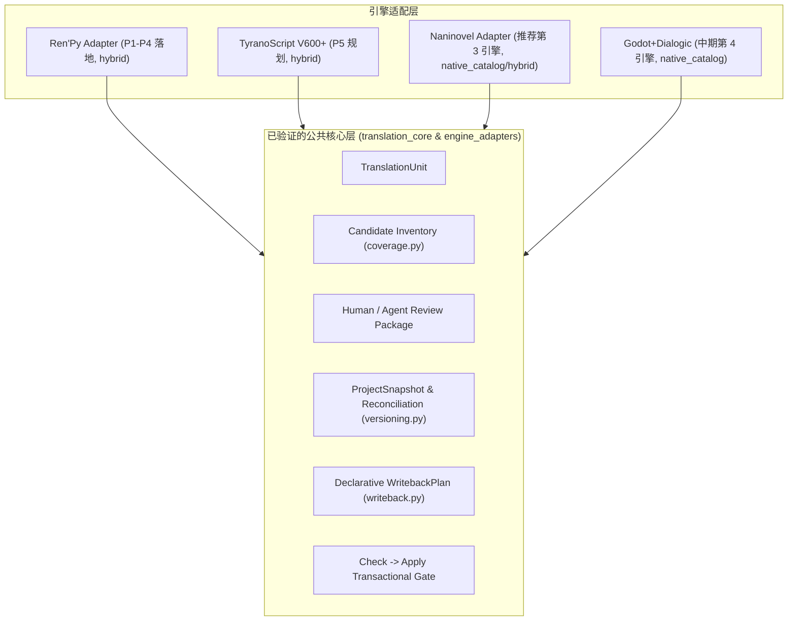

# 视觉小说引擎本地化能力矩阵与后续 Adapter 路线

> **状态**：#272 研究与路线决策基准文档。  
> **关联 Issue**：[#265（引擎适配边界与版本化翻译资产）](https://github.com/hu-border-collie/renpy-translation-lab/issues/265) · [#272（能力矩阵与后续路线）](https://github.com/hu-border-collie/renpy-translation-lab/issues/272)  
> **前置依赖**：本路线决策必须在 #265 P5（TyranoScript V600+ 验证 Adapter）与 P6（产品化收尾）交付并关闭后，方可为推荐候选创建独立实现 Issue。

---

## 1. 背景与核心定位

### 1.1 研发背景
在 [#265](https://github.com/hu-border-collie/renpy-translation-lab/issues/265) 中，近期工作范围已被明确收窄：
1. **Ren'Py** 作为主生产引擎，率先完成了 `EngineAdapter`、`CoverageAudit`、`ProjectSnapshot`、`Reconciliation` 与 `ReuseCandidate`（P0–P4 已落地，见 [Ren'Py Engine Adapter 与覆盖审计](../engine_adapter.md)）；
2. **TyranoScript V600+** 作为第二个验证架构边界的 Adapter（P5），用于验证多引擎在 `hybrid` 本地化模式下的抽象通用性与安全写回合同；
3. 其他引擎不进入 #265 的实现范围。

然而，社区与实际翻译场景中对 **Naninovel**、**Godot + Dialogic**、**Visual Novel Maker**、**Monogatari**、**KiriKiri/KAG** 以及 **RPG Maker MV/MZ** 存在广泛的本地化需求。

为避免日后仅凭“脚本表面上容易正则替换”或“用户需求呼声高”盲目立项，本 Issue 建立并维护一份**可刷新、可量化、基于统一架构契约**的本地化能力矩阵，并在 #265 验证完成后为**“第三个 Engine Adapter”**提供明确的技术决策与范围约束。

### 1.2 硬性边界
- **纯研究与路线决策**：本文档仅做技术调研、能力评估与路线决策，**不包含任何新引擎 Adapter 的生产代码实现**。
- **TyranoScript 不作为候选**：TyranoScript 已收敛在 #265 P5，不参与本 Issue 的第三引擎竞选。
- **拒绝泛化承诺**：绝不承诺“支持所有视觉小说引擎”或“支持任意 Godot / RPG Maker 游戏”；必须明确限定受支持的具体引擎版本、官方本地化插件及清晰的排除项。
- **对齐公共安全层**：任何后续 Adapter 必须无条件复用 `translation_core.TranslationUnit`、`check -> apply` 安全合约、声明式 `WritebackPlan` 与版本化快照/复用审计机制，严禁开辟直接改写源码或绕过门禁的私有旁路。

---

## 2. 统一评估维度体系

为确保不同引擎在相同标准下进行横向对比，本文档设定了 12 项标准化评估维度：

| 序号 | 评估维度 | 核心考量指标 |
| :---: | :--- | :--- |
| **D1** | **引擎版本与维护状态** | 引擎/插件当前活跃度、长期维护策略、主版本迭代下的本地化 API 稳定性。 |
| **D2** | **原生本地化制品** | 官方推荐的本地化产物格式（独立脚本、CSV、Gettext PO、JSON 字典、专用 Locale 目录）。 |
| **D3** | **稳定 ID 与溯源能力** | 是否具备引擎级稳定文本 ID / GUID / key / opaque locator；是否支持重定位与 source lineage。 |
| **D4** | **版本差分与旧译保留** | 游戏本体脚本更新后，能否识别新增/修改/删除文本，原生工具能否安全保留已翻译条目。 |
| **D5** | **多语言切换与 Fallback** | 单一工程内是否支持运行时语言切换、首选语言检测、缺失译文的 Fallback 机制。 |
| **D6** | **资源覆盖广度** | 是否覆盖对话、角色名、UI Managed Text、术语表、图片/纹理替换、字体替换、配音替换。 |
| **D7** | **语言学高级特性** | 是否支持上下文消歧（Context / `msgctxt`）、复数形式（Plural Forms）、从右至左文字（RTL/BiDi）。 |
| **D8** | **编码与格式约束** | 字符编码（UTF-8 / Shift-JIS / UTF-16LE）、BOM 要求、换行符、转义序列与排版标签约束。 |
| **D9** | **宏、插件与动态文本** | 宏扩展、自定义标签、动态插值表达式、脚本内嵌代码（JS/TJS/GDScript/C#）对提取的影响。 |
| **D10** | **适配模式归属** | `source_extraction`（源脚本提取）、`native_catalog`（消费官方目录）还是 `hybrid`（双轨并存）。 |
| **D11** | **安全写回与门禁契约** | 是否存在官方支持的无运行时安全导入/写回路径；是否满足声明式 `text_span_replace` / plan 校验。 |
| **D12** | **测试夹具可获得性** | 开源示例工程、最小合法测试 fixture 的获取难度与合规许可证边界。 |

---

## 3. 六大候选引擎能力比对总表

| 评估维度 | 1. Naninovel (Unity) | 2. Godot + Dialogic 2 | 3. Visual Novel Maker | 4. Monogatari | 5. KiriKiri / KAG | 6. RPG Maker MV/MZ |
| :--- | :--- | :--- | :--- | :--- | :--- | :--- |
| **D1. 版本与维护** | 活跃维护 (Naninovel 1.18+ ~ 1.21+ / Unity 2021.3–Unity 6) | 快速迭代 (Godot 4.2+ / Dialogic 2.0 Beta/RC) | 稳定维护 (Degica/KADOKAWA) | 开源活跃 (v2.x / v3.0 Alpha) | 历史遗留 / 派生分支 (krkrz, 吉里吉里Z) | 稳定维护 (Gotcha Gotcha Games / MV & MZ) |
| **D2. 原生产物** | `Resources/Naninovel/Localization/{Locale}/` (Scripts/ & Text/) | Dialogic timeline CSV (`keys,en,ja`), Godot PO (`.po`) | Language Profiles CSV, `data/` JSON 资源图 | `js/translations.js`, `script.js` JS 脚本字典 | `.ks` 场景脚本，无统一原生 catalog | `data/*.json`；依赖第三方插件 `locales/{lang}.json` |
| **D3. 稳定 ID** | 原生稳定 Hash ID（`; 原文 # 1a2b3c` / `译文 # 1a2b3c`） | Dialogic `[tr_id: ...]` / `#id` 标记，PO `msgid` | 原生 `LocalizableString` UID/Index | 无稳定 ID，依赖 key 或 label 序号 | 无原生 ID，依赖行号与标签 | 无原生 ID，依赖 Event/Command 数组下标 |
| **D4. 差分保留** | 原生工具增量更新：保留已译 Hash ID，追加新 ID | 原生 PO `msgmerge` 或 Dialogic "Update CSV files" 差分 | CSV 导入/导出对比，保留已有 UID | 需手动/脚本对比 JS 对象树 | 极差，通常需手动比对 `.ks` | 依赖插件或自行比对 JSON 差异 |
| **D5. 语言切换** | `ILocalizationManager`，内置 UI 与 Fallback | `TranslationServer.set_locale()`，原生 Fallback | 系统菜单内置切换，支持 Profile | 原生 `monogatari.preference('Language')`，UI 动态刷新 | 极难，多需分包或重写脚本 | 依赖第三方多语言插件 |
| **D6. 资源覆盖** | 全面：剧本、角色名、Managed Text (UI)、音频、图片 | 全面：Timeline、角色、Glossary、UI、AssetRemap | 全面：消息、角色、系统、CG/Audio 覆盖 | 文本/UI/角色名；资源需代码切换 | 需在 `.ks` 宏中自行实现条件分支 | 依赖插件实现多语言资源劫持 |
| **D7. 语言特性** | TMP 支持 RTL 与动态字体 Fallback | 原生支持 Context, Plural, RTL/BiDi (FreeType/HarfBuzz) | 支持基础格式化，无原生 Plural/RTL | 基础模板插值，可调 Web `Intl` API | 仅支持基础 Ruby 与排版标签 | 基础转义符（`\V[n]`, `\N[n]`），无 Plural |
| **D8. 编码格式** | UTF-8 (无 BOM 推荐) | UTF-8 (无 BOM) | UTF-8 (无 BOM) | UTF-8 (无 BOM) | 碎片化严重：Shift-JIS / UTF-16LE with BOM | UTF-8 (无 BOM) |
| **D9. 动态文本** | 支持表达式 `{var}`，自定义命令需显式参数属性 | Timeline 变量注入，排除自定义 GDScript | 内置插值，排除扩展 JS 插件 | JS 表达式注入，排除动态拼接 | TJS 动态求值难以静态解析 | 插件内嵌 JS 代码难以穷举 |
| **D10. 推荐模式** | `native_catalog` / `hybrid` | `native_catalog` / `hybrid` | `native_catalog` / `hybrid` | `source_extraction` / `hybrid` | `source_extraction` | `source_extraction` / `hybrid` |
| **D11. 安全写回** | 极佳：直接写回纯文本本地化文件，无需 Unity 运行时 | 极佳：写回 CSV/PO，Godot 启动时自动编译 | 良好：通过标准 CSV 写回，严禁直接改 JSON | 一般：直接改写 JS 代码，需语法沙箱 | 高危：直接改写源 `.ks`，极易破坏宏与换行 | 较差：直接改写 monolithic JSON 风险极高 |
| **D12. Fixture 获得** | 极佳：官方开源 demo 丰富，纯文本可独立提取 | 极佳：Dialogic 官方开源测试工程 | 一般：需购买 VN Maker 或自建最小工程 | 极佳：完全开源 (MIT) | 较难：开源样例多年代久远、编码不一 | 良好：大量开源/公共域 MV/MZ 演示工程 |
| **综合评级** | **A+ (首选推荐)** | **A (中期跟进)** | **B+ (中期备选)** | **B (受限候选)** | **C (高风险后置)** | **C- (异构压力测试)** |

---

## 4. 各引擎深度技术评估

### 4.1 Naninovel (Unity) — 综合评级：A+ (首选推荐)

#### 4.1.1 架构与本地化机制
Naninovel 是 Unity 生态中最具工业化标准的视觉小说引擎扩展。其本地化架构采用**完全隔离的目录镜像模式**，将源工程与多语言产物解耦：
- **本地化根目录**：`Assets/Resources/Naninovel/Localization/{Locale}/`（或配置的 Addressable 路径）；
- **剧本文本（Script Localization）**：镜像存放在 `Localization/{Locale}/Scripts/{ScriptPath}.nani`；
- **托管文本（Managed Text）**：存放在 `Localization/{Locale}/Text/`（如 `CharacterNames.txt`, `UI.txt`）。

#### 4.1.2 语法与稳定 ID 规范
在 Naninovel 剧本本地化文件中，每个可翻译条目均带有唯一的 Hash ID（例如 `# b884df8d`），并采用注释保存原文、独立行保存译文的标准格式：
```naniscript
; man: こんにちは！ # b884df8d
man: Hello! # b884df8d

; @choice "はい" goto:.Yes # 7a1c9e02
@choice "Yes" goto:.Yes # 7a1c9e02
```
Managed Text 产物采用清晰的 Key-Value 格式：
```text
# CharacterNames.txt
Kohaku: 琥珀
Yuko: 优子
```

#### 4.1.3 增量更新与差分保护
- 当源剧本发生修改时，Naninovel 官方本地化工具（Localization Utility）重新生成本地化文件时会**按 Hash ID 进行增量比对**：
  1. 保留已有翻译条目；
  2. 仅向对应位置追加新增加的 Hash ID 与原文注释；
  3. 标记废弃/孤立的 Hash ID。
- 这与本项目的 `ProjectSnapshot` 和 `Reconciliation` 模型的证据链（`exact_reuse`, `moved_reuse`, `source_modified_reference`）具有最高对称性。

#### 4.1.4 Adapter 接入与写回安全性
- **推荐模式**：`native_catalog` / `hybrid`；
- **写回路径**：本地化产物均为标准 UTF-8 纯文本，**完全无需依赖 Unity Editor 运行时环境**，CLI / GUI 可以直接完成静态 AST 解析与声明式 `text_span_replace` 原子写回；
- **明确排除项**：
  1. 排除未通过 Naninovel 托管、直接硬编码在 C# MonoBehavior 中的 UI 字符串；
  2. 排除自定义 Naninovel Command 中未声明为 `[LocalizableParameter]` 的参数。

---

### 4.2 Godot + Dialogic 2 — 综合评级：A (中期跟进)

#### 4.2.1 架构与本地化机制
Dialogic 2 是 Godot 4 引擎上主流的分支对话系统，深度集成 Godot 原生 `TranslationServer`：
- **产物结构**：在 Dialogic 设置中启用本地化后，可导出为**按工程**或**按 Timeline**的 CSV 文件（或标准 Gettext `.po` 文件）；
- **Timeline 标记**：Dialogic 在 Timeline 事件后生成唯一 ID（如 `#id:1a2b` 或 `[tr_id: ...]`）；
- **CSV 格式示例**：
  ```csv
  keys,en,zh_CN,ja
  Text/timeline_1/text_1a2b,"Hello, traveler!","你好，旅人！","こんにちは、旅人！"
  Character/hero/name,"Arthur","亚瑟","アーサー"
  Glossary/excalibur/title,"Excalibur","王者之剑","エクスカリバー"
  ```

#### 4.2.2 高级语言学能力
借助 Godot 4 的底层能力，Dialogic 体系原生支持：
- 上下文消歧（Context / `msgctxt`）；
- 复数形式（Plural Forms / `nplurals`）；
- 完整的 RTL（阿拉伯语/希伯来语）与双向文本排版（BiDi），以及 TextServer 的 FreeType/HarfBuzz 字体回退机制。

#### 4.2.3 边界与风险
- **版本稳定性风险**：Dialogic 2.0 目前仍处于 Beta / RC 演进阶段，部分导出与事件 API 存在变动可能；
- **范围约束**：必须严格限定为“仅支持 Dialogic Timeline 与 Glossary 导出的标准 CSV/PO”，严禁泛化为解析 Godot 游戏中任意自定义 GDScript 脚本。

---

### 4.3 Visual Novel Maker — 综合评级：B+ (中期备选)

#### 4.3.1 架构与本地化机制
基于 Chromium/Electron 与 HTML5 架构的商业 VN 引擎：
- **数据核心**：工程数据为 `data/` 目录下的庞大 JSON 资源树（`SCENES.json`, `SYSTEM.json` 等）；
- **本地化通道**：通过引擎内置的 **Language Profiles** 工具导出与导入 CSV；
- **稳定标识**：每个可本地化节点在 JSON 中拥有固定的 GUID（`LocalizableString`）。

#### 4.3.2 格式与安全写回约束
- **CSV 交换格式**：
  ```csv
  Index/UID,Source,Translation
  "d1a2-3f4e-5678","Good morning!","早上好！"
  ```
- **核心风险与安全红线**：
  - **严禁直接写回 `data/*.json`**：由于 JSON 内部节点高度引用且格式庞大，直接修改 JSON 极易导致工程破坏；
  - **必须强制通过官方 CSV 交换**：Adapter 仅负责 CSV 提取、校验与写回，由用户或工具通过官方 Language Profile 导入引擎。

---

### 4.4 Monogatari — 综合评级：B (受限候选)

#### 4.4.1 架构与本地化机制
基于现代 Web 技术的开源视觉小说引擎（HTML5/JavaScript）：
- **多语言机制**：在 `js/translations.js` 中向 `monogatari.translation()` 注册多语言词典，或在 `js/script.js` 中按语言定义分支：
  ```javascript
  monogatari.translation ('English', {
      'Start': 'Start Game',
      'Welcome': 'Welcome to the world!'
  });
  monogatari.translation ('Español', {
      'Start': 'Iniciar Juego',
      'Welcome': '¡Bienvenido al mundo!'
  });
  ```
- **剧本分支**：支持在 `monogatari.script({...})` 中通过语言 Key 组织语句。

#### 4.4.2 核心痛点与风险
- **无独立 Catalog 制品**：缺乏像 Ren'Py `.rpy` / Naninovel `.nani` 这样的独立多语言产物，多语言数据直接与 JavaScript 业务代码混杂；
- **结构对称性严苛**：多语言脚本若存在 Statement 或 Action 数量/顺序不对称，多语言切换时会导致引擎状态机与存档崩溃；
- **Adapter 模式**：必须采用 `source_extraction` / `hybrid`，且需建立 JS AST 语法级别的强校验沙箱。

---

### 4.5 KiriKiri / KAG (KiriKiri 2 / Z / KAG3 / KAGEX) — 综合评级：C (高风险后置)

#### 4.5.1 架构特征与现状
经典的 Windows 视觉小说引擎家族，使用 `.ks` 场景脚本与 TJS2 脚本：
- **历史包袱严重**：原生 KAG3 无单构建多语言切换规范，多数游戏依靠“替换 `.ks` 重新封包”或打第三方 TJS 补丁实现；
- **编码与 BOM 陷阱**：
  - KAG2/3 遗留项目多为 **Shift-JIS**；
  - 吉里吉里Z (krkrz) 标准为 **UTF-16LE with BOM** (`0xff 0xfe`)；
  - 部分开源重构版支持 **UTF-8 with BOM** (`0xef 0xbb 0xbf`)；
  - 编码混用会直接导致引擎崩溃或乱码；
- **动态求值与宏滥用**：大量脚本通过自定义宏重写对话行为，内嵌 `[iscript]` 进行 TJS 字符串动态计算，静态 AST 难以可靠提取。

#### 4.5.2 结论
适配成本极高且缺乏统一规范，定位为**高风险、后置评估项**。

---

### 4.6 RPG Maker MV/MZ — 综合评级：C- (异构压力测试)

#### 4.6.1 架构特征与现状
基于 HTML5/NW.js 的 RPG 引擎，广泛用于剧情 RPG 与视觉小说类作品：
- **原生多语言缺失**：RPG Maker MV/MZ 原生设计为单语言项目；
- **插件生态碎片化**：
  - 社区多语言完全依赖第三方插件（如 `DKTools Localization`, `VisuStella MZ Localization`, `Eli MZ`）；
  - 各插件在 `locales/` 下自定义 JSON/CSV 结构，并在编辑器中使用 `${text_key}` 占位符；
  - 插件间存在严重的加载顺序与标签渲染冲突（例如 VisuStella `<WordWrap>` 与本地化插件字符转义冲突）。

#### 4.6.2 结论
严禁承诺支持“任意 RPG Maker 项目”，仅可作为远期异构数据结构的压力测试。

---

## 5. 对照已验证的 Adapter 契约

对照 #265 已验证的 Ren'Py Adapter 以及 P5 规划的 TyranoScript Adapter：



### 5.1 候选清单与覆盖审计可复用性
- **Naninovel** 能够完美输出 `coverage_candidates.jsonl`：
  - 剧本文本映射为 `Occurrence[TranslationUnit]`，opaque locator 保存 `{ "file": "script.nani", "id": "1a2b3c", "line": 42 }`；
  - 未引用的 managed text 或不支持的 custom command 标记为 `unsupported` / `unknown`，完全融入 `coverage.py` 门禁。

### 5.2 版本快照与跨版本 Reconciliation 可复用性
- **Naninovel** 的原生 hash ID 能够作为 `occurrence_id` 与 `lineage_id` 匹配的最高置信度依据；
- 当源脚本发生增删时，`reconcile-project-snapshots` 可以准确报告 `exact_reuse`、`moved_reuse` 或 `source_modified_reference`。

### 5.3 安全写回可复用性
- **Naninovel** 的本地化文件属于格式极简的行式文本或 CSV，`RenPyAdapter` 积累的 `text_span_replace` 与 source snapshot 校验可以直接复用，无需为写回引入任何专有文件写入机制。

---

## 6. 第三 Adapter 推荐决策与后续路线

### 6.1 最终决策结论
在 #265（Ren'Py + TyranoScript V600+）全部交付并验证完成后：

> **推荐将 Naninovel (Unity) 作为本工具支持的第三个 Engine Adapter。**

### 6.2 推荐理由总结
1. **架构契合度第一**：原生具备稳定的文本 ID、明确的 `Localization/<Language>/` 隔离目录、完善的 Managed Text 机制，天然匹配 `native_catalog` / `hybrid` 最佳实践。
2. **零运行时外部依赖**：无论是源脚本 `.nani` 还是本地化文本/CSV，均为标准的 UTF-8 文本文件，可以在没有 Unity Editor 环境的 Linux/Windows CLI 及 GUI 中快速、轻量、确定性地完成解析与原子写回。
3. **市场价值与用户群体明确**：Naninovel 是当前 Unity 平台上商业与同人视觉小说开发的事实标准插件之一，拥有大量高质量的中大型剧情作品。

---

## 7. Naninovel Adapter 立项前置条件与规范预设

当 #265 关闭且正式立项支持 Naninovel 时，必须满足以下规范：

### 7.1 支持版本与输入产物
- **受支持引擎/插件版本**：Naninovel 1.18+（运行于 Unity 2021.3 LTS / 2022.3 LTS / Unity 6）。
- **输入产物**：
  - 源剧本目录：`Scripts/*.nani`
  - 本地化根目录：`Resources/Naninovel/Localization/<TargetLanguage>/`
  - 包含 `Scripts/*.nani`（Localized Scripts）与 `Text/*.txt`（Managed Text 表格）。

### 7.2 明确排除项 (Out of Scope)
1. 未通过 Naninovel 托管、直接硬编码在 C# MonoBehavior 中的 UI 字符串；
2. 第三方 Unity 插件（如 TextMeshPro 独立 Asset、I2 Localization）的私有二进制资产；
3. 打包后的 Unity AssetBundle / `.assets` 资产文件（本工具坚持源工程与规范本地化目录，不从事资产逆向提取）。

### 7.3 测试夹具 (Fixture) 要求
- 建立遵循 MIT 许可证的离线测试工程 `tests/fixtures/naninovel_sample_project/`；
- 包含至少 3 个 `.nani` 剧本、1 个 Managed Text 文件、带参数的通用 command（如 `@choice`, `@print`）、角色名声明与内嵌表达式 `{var}`；
- 包含标准覆盖测试：正常对话、角色名、未注册自定义宏、语法错误脚本与版本更新差分场景。

---

## 8. 参考资料与官方文档

- **Naninovel Localization Guide**: <https://naninovel.com/guide/localization>
- **Naninovel Managed Text**: <https://naninovel.com/guide/managed-text>
- **Dialogic 2 Translation Documentation**: <https://docs.dialogic.pro/translation.html>
- **Godot Internationalization Engine**: <https://docs.godotengine.org/en/stable/tutorials/i18n/internationalizing_games.html>
- **Visual Novel Maker Localization Context Menu**: <https://asset.visualnovelmaker.com/help/Context_Menu.htm>
- **Visual Novel Maker Language Profiles**: <https://asset.visualnovelmaker.com/help/Visual_Novel_Maker.htm>
- **Monogatari Internationalization**: <https://monogatari.io/v2/configuration-options/game-configuration/internationalization>
- **KiriKiri 2 / KAG3 Preparation**: <https://krkrz.github.io/krkr2doc/kag3doc/contents/Prepare.html>
- **TyranoScript Translation Reference (#265)**: <https://tyranoscript.com/usage/advance/translate>
- **RPG Maker MZ Official Help**: <https://rpgmakerofficial.com/product/MZ_help-en/index.html>
