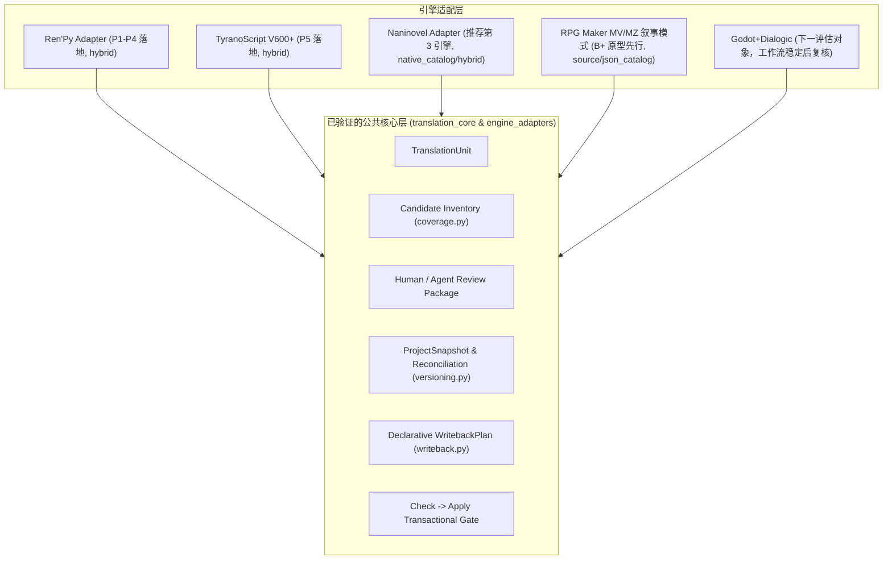

# 视觉小说引擎本地化能力矩阵与后续 Adapter 路线

> **状态**：#272 研究与路线决策基准文档。
> **关联 Issue**：[#265（引擎适配边界与版本化翻译资产）](https://github.com/hu-border-collie/renpy-translation-lab/issues/265) · [#272（能力矩阵与后续路线）](https://github.com/hu-border-collie/renpy-translation-lab/issues/272)
> **前置依赖**：本路线决策必须在 #265 P5（TyranoScript V600+ 验证 Adapter）与 P6（产品化收尾）交付并关闭后，方可为推荐候选创建独立实现 Issue。
> **核对日期**：2026-08-18。官方版本与语法以各引擎现行文档为准；刷新本表时同步更新日期。

---

## 1. 背景与核心定位

### 1.1 研发背景
在 [#265](https://github.com/hu-border-collie/renpy-translation-lab/issues/265) 中，近期工作范围已被明确收窄：
1. **Ren'Py** 作为主生产引擎，率先完成了 `EngineAdapter`、`CoverageAudit`、`ProjectSnapshot`、`Reconciliation` 与 `ReuseCandidate`（P0–P4 已落地，见 [Ren'Py Engine Adapter 与覆盖审计](../engine_adapter.md)）；
2. **TyranoScript V600+** 作为第二个验证架构边界的 Adapter（P5），用于验证多引擎在 `hybrid` 本地化模式下的抽象通用性与安全写回合同；
3. 其他引擎不进入 #265 的实现范围。

然而，社区与实际翻译场景中对 **Naninovel**、**Godot + Dialogic**、**Visual Novel Maker**、**Monogatari**、**KiriKiri/KAG** 以及 **RPG Maker MV/MZ** 存在广泛的本地化需求。

为避免日后仅凭“脚本表面上容易正则替换”或“用户需求呼声高”盲目立项，本 Issue 建立并维护一份**可刷新、可量化、基于统一架构契约**的本地化能力矩阵，并在 #265 验证完成后为**“第三个 Engine Adapter”**提供明确的技术决策与范围约束。

### 1.2 硬性边界
- **纯研究与路线决策**：本文档仅做技术调研、能力评估与路线决策，**不包含任何新引擎 Adapter 的生产代码实现**。
- **TyranoScript 不作为候选**：TyranoScript 已收敛在 #265 P5，不参与本 Issue 的第三引擎竞选。
- **拒绝泛化承诺**：绝不承诺“支持所有视觉小说引擎”或“支持任意 Godot / RPG Maker 游戏”；必须明确限定受支持的具体引擎版本、官方本地化插件及清晰的排除项。
- **双轨推进与优先级调整**：Naninovel 维持作为 Unity 体系现代纯文本本地化的**首选推荐第三引擎**。同时，鉴于本地已有长篇纯 ADV 游戏作为人工验证样本，将 **RPG Maker MV/MZ 纯叙事模式（Narrative/ADV Mode）** 从原评级 C- 提权至 **B+（实战原型先行候选）**。B+ 是待验证的研究评级，不代表仓库 fixture 或 Adapter 已就绪；可再分发的合成夹具仍须建立（见 §7.4）。两者拟形成互补验证：Naninovel 验证离线纯文本 Catalog 机制，RPG Maker 叙事模式验证复杂 JSON 事件树的节点精确替换与字体回退防御。
- **对齐公共安全层**：任何后续 Adapter 必须无条件复用 `translation_core.TranslationUnit`、`check -> apply` 安全合约、声明式 `WritebackPlan` 与版本化快照/复用审计机制，严禁开辟直接改写源码或绕过门禁的私有旁路。

---

## 2. 统一评估维度体系

为确保不同引擎在相同标准下进行横向对比，本文档设定了 12 项标准化评估维度：

| 序号 | 评估维度 | 核心考量指标 |
| :---: | :--- | :--- |
| **D1** | **引擎版本与维护状态** | 引擎/插件当前活跃度、长期维护策略、主版本迭代下的本地化 API 稳定性。 |
| **D2** | **原生本地化制品** | 官方推荐的本地化产物格式（独立脚本、CSV、Gettext PO、JSON 字典、专用 Locale 目录）。 |
| **D3** | **稳定 ID 与溯源能力** | 是否具备引擎级稳定文本 ID / GUID / key / opaque locator；是否支持重定位与 source lineage。 |
| **D4** | **版本差分与旧译保留** | 游戏本体脚本更新后，能否识别新增/修改/删除文本，原生工具能否安全保留已翻译条目。 |
| **D5** | **多语言切换与 Fallback** | 单一工程内是否支持运行时语言切换、首选语言检测、缺失译文的 Fallback 机制。 |
| **D6** | **资源覆盖广度** | 是否覆盖对话、角色名、UI Managed Text、术语表、图片/纹理替换、字体替换、配音替换。 |
| **D7** | **语言学高级特性** | 是否支持上下文消歧（Context / `msgctxt`）、复数形式（Plural Forms）、从右至左文字（RTL/BiDi）。 |
| **D8** | **编码与格式约束** | 字符编码（UTF-8 / Shift-JIS / UTF-16LE）、BOM 要求、换行符、转义序列与排版标签约束。 |
| **D9** | **宏、插件与动态文本** | 宏扩展、自定义标签、动态插值表达式、脚本内嵌代码（JS/TJS/GDScript/C#）对提取的影响。 |
| **D10** | **适配模式归属** | `source_extraction`（源脚本提取）、`native_catalog`（消费官方目录）还是 `hybrid`（双轨并存）。 |
| **D11** | **安全写回与门禁契约** | 是否存在官方支持的无运行时安全导入/写回路径；是否满足声明式 `text_span_replace` / plan 校验。 |
| **D12** | **测试夹具可获得性** | 开源示例工程、最小合法测试 fixture 的获取难度与合规许可证边界。 |

### 2.1 证据等级

矩阵与深度评估中的陈述按来源标注，避免把社区推断写成已验证事实：

| 标记 | 含义 |
| :--- | :--- |
| `[官方]` | 对照现行官方文档、发行说明或引擎 UI 可直接核对。 |
| `[推断]` | 由官方机制推导，或来自社区实践，尚未用本仓库夹具验证。 |
| `[待夹具验证]` | 涉及本工具 Adapter / coverage / writeback 的集成假设；#265 P5/P6 完成并有 fixture 前不得当成立项依据。 |

第 5 节对 Naninovel 与现有 `coverage.py` / `versioning.py` / `writeback.py` 的对照全部属于 `[待夹具验证]`。

---

## 3. 六大候选引擎能力比对总表

| 评估维度 | 1. Naninovel (Unity) | 2. Godot + Dialogic 2 | 3. Visual Novel Maker | 4. Monogatari | 5. KiriKiri / KAG | 6. RPG Maker MV/MZ (叙事模式) |
| :--- | :--- | :--- | :--- | :--- | :--- | :--- |
| **D1. 版本与维护** | `[官方]` 活跃维护：当前稳定 **1.21**，仅 Unity **6.0 / 6.3 LTS**。1.18–1.20 已停支，不在推荐窗口 | `[官方]` 快速迭代：Dialogic **2.0 Alpha 20**（2026-07-21），要求 Godot **4.5+**，建议 **4.6+**。仍是 Alpha，不是 Beta/RC | `[官方]` 稳定维护 (Degica/KADOKAWA)；无公开语义化版本合同 | `[官方]` 开源活跃 (v2.x；v3.0 另线) | `[官方]` 历史遗留 / 派生分支 (krkrz, 吉里吉里Z) | `[官方]` 稳定维护 (MV v1.6.2 / MZ)；底层引擎与数据格式完全冻结，无破坏性变更风险 |
| **D2. 原生产物** | `[官方]` `Resources/Naninovel/Localization/{Locale}/`（Scripts 本地化文档与 Text/ Managed Text）；另有 Spreadsheet CSV 交换 | `[官方]` Dialogic 仅官方导出 **CSV**；Godot 自身另支持 Gettext `.po`，不是 Dialogic 导出通道 | `[官方]` Language Profiles CSV；工程本体是 `data/` JSON | `[官方]` 剧情在 `monogatari.script({ Language: {...} })`；`translation()` 只服务 UI 字符串 | `[官方]` `.ks` 场景脚本，无统一原生 catalog | 原生单体 `data/Map*.json` 与 `CommonEvents.json`；社区插件自定 `locales/` |
| **D3. 稳定 ID** | `[官方]` 源脚本 `text\|#id\|`；本地化文档独立 `# id` 头。1.21 用 Text Identifier 工具，不再提供 Stable Identification | `[官方]` Timeline 行尾数字 `#id:N`；CSV key 形如 `Text/1/text`。Godot PO 另用 `msgid` | `[官方]` Language Profile 的 UID/Index | `[官方]` 无稳定 ID；依赖 label 名与 statement 下标 | `[官方]` 无原生 ID，依赖行号与标签 | 事件指令坐标稳定 ID：`mapId:eventId:pageId:cmdIndex` |
| **D4. 差分保留** | `[官方]` Localization 工具按文本 ID 增量更新，未改动的条目保留译文 | `[官方]` Dialogic「Update CSV files」；Godot PO 可用 `msgmerge`（属引擎层） | `[官方]` CSV 导入/导出对比，保留已有 UID | `[推断]` 需手动/脚本对比语言对象树 | `[推断]` 极差，通常需手动比对 `.ks` | `[推断]` 纯 ADV 模式下事件流呈线性对白，便于通过事件 ID 与指令序号做 AST 对账 |
| **D5. 语言切换** | `[官方]` 内置 Language 下拉、`Default Locale` / `Auto Detect Locale` 与 Fallback | `[官方]` `TranslationServer.set_locale()` | `[官方]` 系统菜单 Profile 切换 | `[官方]` `MultiLanguage` + `preference('Language')` | `[推断]` 极难，多需分包或重写脚本 | 单语言工程（硬编码）；可选择多语言插件，或通过本工具实现离线项目多语言副本生成 |
| **D6. 资源覆盖** | `[官方]` 剧本、Managed Text、可替换的背景/音频等资源镜像 | `[官方]` Timeline、角色名、Glossary；资源 remap 走 Godot | `[官方]` 消息、角色、系统、CG/Audio 走 Language Profile | `[官方]` 剧本文本 + UI 词典；资源需代码切换 | `[推断]` 需在 `.ks` 宏中自行实现条件分支 | 覆盖地图对白（401）、选择支（102）、公共事件、角色名、系统用语、图片立绘替换 |
| **D7. 语言特性** | `[官方]` TMPro 支持 RTL（需额外设置）与按 locale 换字体 | `[官方]` Godot TextServer：Context、Plural、RTL/BiDi、HarfBuzz | `[推断]` 支持基础格式化，无原生 Plural/RTL | `[官方]` UI 有内置语种；复数等可走 Web `Intl` | `[官方]` 基础 Ruby 与排版标签 | 基础控制码（`\pop[n]`, `\c[n]`, `\i[n]`, `\V[n]`），无原生 Plural；字体需解决 CJK 方块乱码 |
| **D8. 编码格式** | `[官方]` UTF-8 | `[官方]` UTF-8 | `[官方]` UTF-8 | `[官方]` UTF-8 | `[官方]` 碎片化：Shift-JIS / UTF-16LE with BOM / 部分 UTF-8+BOM | `[官方]` UTF-8 |
| **D9. 动态文本** | `[官方]` `{expr}`；自定义命令须 `ILocalizable` + `LocalizableTextParameter` 才会进目录 | `[官方]` Timeline 变量；自定义事件/任意 GDScript 不在 Dialogic CSV 内 | `[推断]` 内置插值；扩展 JS 插件不在 CSV 合同内 | `[官方]` JS 表达式；动态拼接会破坏存档对称性 | `[官方]` `[iscript]` / TJS 动态求值难以静态解析 | 纯 ADV 模式下无复杂战斗内嵌 JS，对白控制码高度规整；复杂 RPG 模式存在插件内嵌代码 |
| **D10. 推荐模式** | `native_catalog` / `hybrid` | `native_catalog` / `hybrid` | `native_catalog` / `hybrid` | `source_extraction` / `hybrid` | `source_extraction` | `source_extraction`（JSON 写回合同待扩展） |
| **D11. 安全写回** | `[官方]` 目录与可选 CSV 均为文本，无需 Unity 运行时。`[待夹具验证]` 公共 `text_span_replace` 消费 | `[官方]` 写回 Dialogic CSV；CSV 由 Godot 编辑器资源导入器生成 `.translation`，运行时加载导入后的资源。不要把 PO 写成 Dialogic 产物 | `[官方]` 只写官方 CSV；严禁直接改 `data/*.json` | `[推断]` 改写 JS 源，需 AST 沙箱 | `[推断]` 高危：直接改写源 `.ks` | `[待夹具验证]` 内存反序列化 -> 节点精确定位替换 -> 声明式原子落盘；严禁粗暴正则覆写 |
| **D12. Fixture 获得** | `[官方]` 官方 localization sample。[待夹具验证] MIT 离线夹具与许可证需立项时确认 | `[官方]` Dialogic 仓库与文档示例开源 | `[推断]` 需购买 VN Maker 或自建最小工程 | `[官方]` 引擎 MIT；夹具可自建 | `[推断]` 开源样例多年代久远、编码不一 | `[待夹具验证]` 有本地人工验证样本；未记录可再分发授权，不能据此认定仓库 / CI 夹具就绪。须自建最小合成 fixture（§7.4） |
| **综合评级** | **A+ (首选推荐 / 唯一第三引擎)** | **A (下一评估对象；Alpha 未稳)** | **B+ (更后备选)** | **B (受限候选)** | **C (高风险后置)** | **B+ (实战原型先行候选 / 叙事型专属)** |

---

## 4. 各引擎深度技术评估

### 4.1 Naninovel (Unity) — 综合评级：A+ (首选推荐)

#### 4.1.1 架构与本地化机制
Naninovel 采用**完全隔离的目录镜像**，把源工程与多语言产物解耦 `[官方]`：
- **本地化根目录**：`Resources/Naninovel/Localization/{Locale}/`（`Loader > Path Prefix` 可改；也可走 Addressable）；
- **剧本文本地化文档**：`Localization/{Locale}/Text/Scripts/`（由 `Naninovel -> Tools -> Localization` 生成，不是源 `.nani` 的逐行副本）；
- **托管文本（Managed Text）**：`Localization/{Locale}/Text/`（如 `CharacterNames.txt`, `UI.txt`）；
- **Spreadsheet**：可把脚本与 Managed Text 编成 CSV 再导回，仍以先跑 Localization 工具为前提。

#### 4.1.2 语法与稳定 ID 规范
1.21 起用 **Text Identifier**（`Naninovel -> Tools -> Text Identifier`）给源脚本写入稳定 ID；旧的 Stable Identification 已移除 `[官方]`。

源脚本把 ID 附在可本地化片段后，形如 `text|#id|`；1.21 的标签分隔符是 `#`（`@goto #Yes` / `@goto Script#Label`），不再使用 `goto:.Yes`：

```naniscript
Kohaku: Hey!|#1|[-] What's up?|#2|
@choice "Option 1|#3|"
@choice "Option 2|#4|"
@goto #Yes
```

本地化文档使用独立 `# id` 头、`;` 原文注释、下一行译文；合并行用 `# id1|id2|id3` 与 `|` 占位；注解行是 `; > ...`，不得写入译文：

```naniscript
# aj0e5dea
; Aliquam ut <b>ultricies</b> enim.
Оценивая блеск <b>металлического</b> шарика.

# id1|id2|id3
; Looks like rain is starting|. Hey, |, hurry up!
Похоже, дождь начинается|. Эй, |, поспеши!

# id1
; > @choice "|#id1|" set:route="left"
; Go left
```

Managed Text 仍是 key-value：

```text
# CharacterNames.txt
Kohaku: 琥珀
Yuko: 优子
```

#### 4.1.3 增量更新与差分保护
官方 Localization 工具再次生成时按文本 ID 增量比对：保留未改动条目的译文，追加新 ID，孤立 ID 可识别 `[官方]`。

这与本仓库的快照 / reconciliation **证据形态相近**，但类名不能混用 `[待夹具验证]`：
- `reconcile-project-snapshots` 报告 `confirmed_lineage` / `locator_exact` / `content_exact` / `moved_exact` / `source_modified`（以及 `added` / `deleted` / `ambiguous`）；
- `build-reuse-candidates` 再把上述 match kind 映射为 `exact_reuse` / `moved_reuse` / `source_modified_reference`。

Naninovel 文本 ID 适合作为 opaque locator 载荷和 lineage **候选证据**，不能同时充当 `occurrence_id` 与 `lineage_id`。

#### 4.1.4 Adapter 接入、范围与写回
- **推荐模式**：`native_catalog` / `hybrid`；
- **写回路径**：本地化文档与 Managed Text 均为 UTF-8 文本，**无需 Unity Editor 运行时**。公共 `writeback.py` 可消费 `target_root=localization_catalog` 的 `text_span_replace`；该操作仅支持单行内非空源片段替换，多行译文与空译文插入仍须设计并验证，不能假设任意本地化文档都可直接形成合法 plan `[待夹具验证]`。

**支持版本**：Naninovel **1.21** + Unity **6.0 LTS 或 6.3 LTS**（须最新 patch；非 LTS 不支持）`[官方]`。
**明确不支持**：1.18、1.19、1.20 及 Unity 2021.3 / 2022.3 作为推荐窗口；若将来单开遗留车道须另写立项说明。

**输入制品**：
- 源剧本：`*.nani`（含 `|#id|`）；
- 本地化根：`Resources/Naninovel/Localization/<TargetLanguage>/`；
- 本地化文档：`Text/Scripts/` 下的 `# id` 文档与 `Text/*.txt` Managed Text。

**明确排除项**：
1. 未走 Naninovel 托管、硬编码在 C# `MonoBehaviour` 中的 UI 字符串；
2. 未实现 `Command.ILocalizable` 的自定义命令，或参数类型不是 `LocalizableTextParameter` 的字段（官方示例值为 `"Lorem ipsum|#id|"`）。不存在 `[LocalizableParameter]` 特性；
3. 第三方 Unity 插件（独立 TMP Asset、I2 Localization 等）的私有二进制；
4. 打包后的 AssetBundle / `.assets`（不做资产逆向）。

---

### 4.2 Godot + Dialogic 2 — 综合评级：A (下一评估对象)

#### 4.2.1 架构与本地化机制
Dialogic 2 深度使用 Godot `TranslationServer`，但 **Dialogic 自身目前只支持 CSV** `[官方]`。Godot 引擎另支持 Gettext；那是引擎层能力，不是 Dialogic「导出标准 `.po`」。

启用 Translation 并「Update CSV files」后，官方 CSV 形如：

```csv
keys,en,ja
Text/1/text,Hello World!,こんにちは世界！
```

Timeline 文本编辑器在事件后写入数字翻译 ID：

```dtl
Character: Hello world! #id:14
Do you like Visual Novels? #id:15
- Yes, I do! #id:16
```

`#id:N` 与 `Text/1/text` 是官方形状。`[tr_id: ...]`、十六进制 `#id:1a2b`、`Text/timeline_1/text_1a2b` 属于旧稿推断，在有 Dialogic 夹具前不要当 parser 合同。

角色名进入 per-project CSV；Glossary 的非 `_` 私有 `String` 属性也会进 CSV。

#### 4.2.2 高级语言学能力
Godot 4 TextServer 提供 Context / Plural / RTL / BiDi 与 HarfBuzz `[官方]`。Dialogic CSV 本身不导出 `msgid`/`msgctxt`；复数与上下文若立项，要单独核对是走 Godot PO 还是 Dialogic CSV 扩展。

#### 4.2.3 支持版本、输入制品与排除项
- **支持版本**：Dialogic **2.0-alpha-20** + Godot **4.5+**（官方建议 4.6+）。Alpha 17 已放弃 Godot 4.2。在出现真实 Beta/RC 前，不把「中期跟进 / 第四引擎」写进路线。
- **输入制品**：Dialogic Translation 设置生成的 CSV（Per Project 或 Per Timeline）；角色与 Glossary 的 per-project CSV。
- **明确排除**：
  1. 任意自定义 GDScript / 非 Dialogic 场景文本；
  2. 自定义 Dialogic 事件里未进入 CSV 的字符串；
  3. 把 Godot `.po` 当成 Dialogic 原生导出；
  4. 在 API 仍可能 breaking 时承诺跨 Alpha 的稳定写回。

---

### 4.3 Visual Novel Maker — 综合评级：B+ (更后备选)

#### 4.3.1 架构与本地化机制
基于 Chromium/Electron 与 HTML5 的商业 VN 引擎：
- **数据核心**：`data/` 下的 JSON 资源树（`SCENES.json`, `SYSTEM.json` 等）；
- **本地化通道**：内置 **Language Profiles** 导入/导出 CSV；
- **稳定标识**：可本地化节点带 UID/Index。

#### 4.3.2 格式、范围与安全写回
```csv
Index/UID,Source,Translation
"d1a2-3f4e-5678","Good morning!","早上好！"
```

- **支持版本**：当前 Degica/KADOKAWA 商业发行版中仍提供 Language Profiles 的版本；立项时锁定具体编辑器版本号。
- **输入制品**：Language Profiles 导出的 CSV，而不是 `data/*.json`。
- **明确排除**：
  1. 直接写回 `data/*.json`；
  2. 扩展 JS 插件注入的字符串；
  3. 未走 Language Profile 的运行时拼接文本。

---

### 4.4 Monogatari — 综合评级：B (受限候选)

#### 4.4.1 架构与本地化机制
官方多语言剧本把**语言对象放在顶层**，label 放在各语言内部 `[官方]`。`monogatari.translation()` / `js/translations.js` 是 **UI 字符串表**，不是剧情 catalog：

```javascript
monogatari.script ({
    'English': {
        'Start': [
            'Hi, welcome to your first Visual Novel with Monogatari.',
            'jump other'
        ],
        'other': [
            'Another Label!',
            'end'
        ]
    },
    'Español': {
        'Start': [
            'Hola, bienvenido a tu primer Novela Visual con Monogatari.',
            'jump other'
        ],
        'other': [
            'Otro label!',
            'end'
        ]
    }
});
```

UI 另册：

```javascript
monogatari.translation ('Español', {
    'Start': 'Iniciar Juego'
});
```

官方警告：存档记录的是 `label` + statement 下标；各语言必须保持 **相同 label 名和相同 statement 数量**，否则换语言后存档无效。

#### 4.4.2 支持版本、输入制品、痛点与排除项
- **无独立 Catalog**：多语言数据与 JS 业务代码混在一起。
- **支持版本**：官方 v2 i18n 文档所述 `MultiLanguage` 结构。v3.0 Alpha 另线，不在本候选窗口。
- **输入制品**：语言键组织的 `monogatari.script({...})` 源文件；UI 词典仅作可选 hybrid 第二轨。
- **明确排除**：
  1. 把 `translation()` 当成剧情目录；
  2. 运行时拼接 / 按语言增减 statement 导致不对称的脚本；
  3. 未建 JS AST 沙箱时直接字符串替换。

---

### 4.5 KiriKiri / KAG (KiriKiri 2 / Z / KAG3 / KAGEX) — 综合评级：C (高风险后置)

#### 4.5.1 架构特征与现状
- **无单构建多语言规范**：多数作品靠替换 `.ks` 再封包或打 TJS 补丁；
- **编码**：KAG2/3 多为 Shift-JIS；吉里吉里Z 为 UTF-16LE+BOM；部分重构为 UTF-8+BOM；混用会崩溃或乱码；
- **动态宏**：自定义宏与 `[iscript]` 使静态提取不可靠。

#### 4.5.2 支持版本、输入制品与排除项
- **支持版本**：不锁定「一个 KiriKiri」；KAG3、吉里吉里Z 与各派生分支的语法/编码分开评估。默认后置。
- **输入制品**：已解包的明文 `.ks` / TJS 源树。
- **明确排除**：
  1. 仅有 XP3/封包、无对应源树的发行件；
  2. KAGEX 及项目私有宏方言（须单独立项）；
  3. `[iscript]` 内动态拼出的对白；
  4. 承诺单一编码或单一写回器覆盖全家族。

#### 4.5.3 结论
适配成本极高且缺乏统一规范，定位为**高风险、后置评估项**。

---

### 4.6 RPG Maker MV/MZ — 综合评级：B+ (实战原型先行候选 / 叙事型专属) [原评级 C-]

#### 4.6.1 架构特征与现状
- **引擎与数据结构完全冻结**：RPG Maker MV (v1.6.2) 与 MZ 的底层内核高度成熟固化，数据格式为标准的 UTF-8 JSON，不存在上游引擎剧烈破坏性更新的维护风险；
- **核心文本分布**：剧情对白与选项高度集中于 `data/Map*.json`（165+ 地图）与 `data/CommonEvents.json` 中：
  - Event Code `401`（Show Text）：承载所有对白与旁白文本；
  - Event Code `102`（Show Choices）：承载分支选项文本；
  - Event Code `101`（Show Text Setup）：承载立绘 Face 与说话人头信息；
- **纯视觉小说（ADV）形态的分离**：社区与商业生态中存在相当数量剥离了战斗与数值系统、通过 `NovelStyle` / `GALV_MessageStyles` 等插件改造成纯剧情叙事视觉小说的作品。这类工程的对白高度线性、控制码高度规整（主要为 `\pop[n]`、`\c[n]`、`\i[n]`），彻底避开了传统重度 RPG 战斗插件与动态代码求值的泥潭。

#### 4.6.2 提权依据与边界收敛（Scope Constraints）
* **提权依据与证据边界**：本地长篇 ADV 样本可用于人工观察文本分布和控制码，支持将叙事模式列为 B+ 研究候选；目前未记录其可再分发授权，也未提供仓库内可复现的 Adapter 验证。D12 仍为待满足项，不能将本地持有游戏视为可提交或可在 CI 使用的回归夹具。
* **支持范围（In Scope）**：
  1. 仅限 **RPG Maker MV/MZ 纯叙事/对话模式（Narrative Mode）**；
  2. 地图事件（Code 401 Show Text、Code 102 Show Choices）与公共事件对白；
  3. 规整控制码的占位保护与无损还原（`\pop[n]`, `\c[n]`, `\i[n]`, `\V[n]`）；
  4. 目标语言字体有效性检测与 `www/fonts/gamefont.css` 自动覆写防御；
* **严格排除项（Out of Scope - 严禁发散）**：
  1. 坚决排除战斗数值库（Enemies、Skills、Items、Armors、Troops 等复杂 RPG 资产）；
  2. 坚决排除第三方复杂战斗/UI 插件内嵌脚本动态拼出的代码字符串；
  3. 坚决排除对地图底层瓦片、移动路线与碰撞网格的修改；
  4. 绝不泛化宣传为“支持所有 RPG Maker 游戏”。

#### 4.6.3 安全写回与门禁契约
* **Monolithic JSON 防御**：严禁采用外部民间工具粗暴的正则全局替换；
* **声明式安全写入**：必须采用“内存严格反序列化 -> 基于 `mapId:eventId:pageId:cmdIndex` 坐标精确定位替换 -> JSON 语法与结构完整性自检 -> 声明式原子落盘”；
* **快照备份与回滚**：写回前强制生成源地图快照备份，严格接入 `#265` 的 `check -> apply` 事务门禁（Fail-Closed）。

#### 4.6.4 结论
在收敛至**“纯叙事/视觉小说模式”**的前提下，RPG Maker MV/MZ 具备充沛的实战数据支持与明确的安全写回路径，综合评级提权至 **B+（实战原型先行候选）**。

---

## 5. 对照已验证的 Adapter 契约

对照 #265 已验证的 Ren'Py Adapter 以及 P5 规划的 TyranoScript Adapter。下图只表示**评估顺序**，不把 Godot 写成已承诺的第四引擎：



> **设计假设 / 待 #265 P5/P6 后复核。** 5.1–5.4 描述的是候选引擎若实现 Adapter 时应如何对接现有合同，不是已经存在的集成。

### 5.1 候选清单与覆盖审计
`[待夹具验证]` Naninovel Adapter 应能输出 `coverage_candidates.jsonl`：
- 剧本文本映射为 `Occurrence[TranslationUnit]`，opaque locator 保存 `{ "file": "script.nani", "id": "1a2b3c", "line": 42 }`（`id` 是 locator 载荷，不是 `occurrence_id`/`lineage_id` 本身）；
- 未引用的 managed text、未实现 `Command.ILocalizable` 的自定义命令标记为 `unsupported` / `unknown`，交给 `coverage.py` 门禁。

### 5.2 版本快照与跨版本 Reconciliation
`[待夹具验证]` Naninovel 文本 ID 可作为 locator / `confirmed_lineage` 的**候选证据**。源脚本增删时，`reconcile-project-snapshots` 应报告 `locator_exact`、`moved_exact`、`source_modified` 等 match kind；`build-reuse-candidates` 再映射为 `exact_reuse` / `moved_reuse` / `source_modified_reference`。不要把复用类名写成 reconcile CLI 的输出。

### 5.3 安全写回
`[待夹具验证]` 本地化文档是行式文本（Spreadsheet 路径才是 CSV）。公共 `engine_adapters/writeback.py` 在 `target_root=localization_catalog` 时消费 `text_span_replace` 与 source snapshot 校验。该消费者是公共能力，但当前 span 操作不能跨行或插入空源片段。多行译文、空译文与组合 ID 的处理必须先明确公共合同及测试，不能另写私有文件写入器绕过门禁。

### 5.4 RPG Maker MV/MZ 纯叙事模式 Adapter 设计假设
`[待夹具验证]` 以下为针对纯 ADV 工程的设计假设；本地人工样本不能替代可再分发的合成回归夹具：
- **候选清单与稳定定位**：opaque locator 保存 `{ "file": "data/Map014.json", "map_id": 14, "event_id": 1, "page_index": 0, "cmd_index": 52 }`，严格绑定至对白指令节点；
- **范围收敛**：提取 Event Code `401`（Show Text）与 `102`（Show Choices）；战斗、移动路线与代码事件仍须保留候选定位和分类证据，明确排除或进入 coverage review，不能静默过滤；
- **公共合同前置缺口**：现有 `json_catalog_set` 是写回操作类型，不是 Adapter 模式；`target_json_path` 仅接受非空字符串键，消费者只遍历字典，不支持 `events/pages/list/parameters` 中的数组节点，且目标根仅接受 `localization_catalog`。因此不能直接用于 RPG Maker 源地图。须先设计公共操作的类型化数组路径、源目标根约束与快照校验；本研究不实现该扩展。
- **原子写回契约（待实现）**：公共合同扩展完成后，才能验证地图 JSON 节点替换、无关字段保留、源快照复核与事务写回；禁止 Adapter 私自重写整张地图绕过公共消费者。
- **字符集渲染防御**：提供可选的 `gamefont.css` 自动覆写与中文字体挂载，解决目标语言方块乱码。

---

## 6. 第三 Adapter 推荐决策与后续路线

### 6.1 最终决策结论
在 #265（Ren'Py + TyranoScript V600+）全部交付并验证完成后：

> 1. **主线标准候选**：推荐将 **Naninovel (Unity)** 作为本工具官方支持的第三个 Engine Adapter（代表 Unity 体系现代纯文本与 CSV 离线目录规范）。
> 2. **实战原型先行线**：将 **RPG Maker MV/MZ 纯叙事模式（Narrative Mode）** 列为 B+ 研究候选。先建立 §7.4 的合成回归夹具，再验证 JSON 事件树映射、字体回退与安全写回；本地游戏仅作为补充人工验证样本。

本文件不为第四引擎立项。Godot + Dialogic 仅在 Dialogic 离开 Alpha、导出合同稳定后重新评估。

### 6.2 推荐理由总结
1. **Naninovel：架构契合度第一**：官方文本 ID、隔离的 `Localization/<Language>/` 目录、Managed Text，完美契合 `native_catalog` / `hybrid`，且纯离线零运行时依赖。
2. **RPG Maker 叙事模式：已有人工样本，回归条件待补齐**：
   - 本地长篇 ADV 样本可补充人工检查；公开回归必须使用自行构造并注明许可证的最小 fixture，不能复制未授权游戏地图或文本；
   - 须固定引擎版本和插件组合；JSON 布局及控制码仍需回归验证，不能假设永无变更；
   - 控制码（`\pop[n]`, `\c[n]`, `\i[n]`）规整，可有效验证长篇剧情树的占位保护与单体大 JSON 声明式安全写回。

---

## 7. 立项前置条件与规范预设

当 #265 关闭且正式立项时，必须满足以下规范：

### 7.1 Naninovel 支持版本与输入产物
- **受支持引擎/插件版本**：Naninovel **1.21**，运行于 Unity **6.0 LTS** 或 **6.3 LTS**（最新 patch；非 LTS 不支持）`[官方]`。
- **明确不在窗口内**：Naninovel 1.18–1.20；Unity 2021.3 / 2022.3。
- **输入产物**：
  - 源剧本：已用 Text Identifier 写入 `|#id|` 的 `*.nani`；
  - 本地化根目录：`Resources/Naninovel/Localization/<TargetLanguage>/`；
  - `Text/Scripts/` 本地化文档与 `Text/*.txt` Managed Text。

### 7.2 Naninovel 明确排除项 (Out of Scope)
1. 未通过 Naninovel 托管、直接硬编码在 C# `MonoBehaviour` 中的 UI 字符串；
2. 未实现 `Command.ILocalizable` 的自定义命令，以及非 `LocalizableTextParameter` 的参数；
3. 第三方 Unity 插件（独立 TMP Asset、I2 Localization）的私有二进制资产；
4. 打包后的 Unity AssetBundle / `.assets`（坚持源工程与规范本地化目录，不从事资产逆向）。

### 7.3 Naninovel 测试夹具 (Fixture) 要求
- 建立许可证可再分发的离线工程 `tests/fixtures/naninovel_sample_project/`；
- 包含至少 3 个 `.nani`（含 `|#id|`）、对应 `# id` 本地化文档、1 个 Managed Text、`@choice` / `@print`、角色名与 `{var}`；
- 覆盖：正常对话、角色名、未实现 `ILocalizable` 的自定义命令、语法错误脚本、版本更新差分。

### 7.4 RPG Maker MV/MZ 纯叙事模式立项规范与边界预设
- **受支持引擎版本**：RPG Maker MV (v1.6.2) 及 MZ 纯叙事/视觉小说工程。
- **输入产物**：
  - `data/Map*.json`（地图事件列表）；
  - `data/CommonEvents.json`（公共事件列表）；
  - 可选 `fonts/gamefont.css`（字体配置）。
- **严格排除项 (Out of Scope)**：
  1. 复杂战斗数值资产（Enemies、Skills、Items、Armors、Troops 等）；
  2. 插件脚本中内嵌的动态 JavaScript 字符串；
  3. 地图底层图层、瓦片与碰撞网格数据。
- **测试夹具要求**：
  - 自行构造最小 Map / CommonEvents JSON，使用原创对白与虚构标识；注明作者、来源及可再分发许可证，不复制私有游戏脚本、地图、插件、字体或图像。
  - 覆盖 101/401 对白、102 选项、多事件页、公共事件、控制码及程序生成的长文本；增加源快照变更、节点错位、非法 JSON 和结构阻断负例，验证失败时不写回。
  - 增加数组索引越界、节点类型变化、字符串键与整数索引混淆、重复或冲突目标、非法目标根的拒绝用例，并确认未修改字段保留。
  - 在仓库 / CI 中验证提取、定位、无损写回和失败门禁后，才可将 D12 标记为就绪。本地游戏仅用于补充人工烟测，单独记录引擎版本与验证结果，不提交游戏资产。

---

## 8. 参考资料与官方文档

- **Naninovel Localization Guide**: <https://naninovel.com/guide/localization>
- **Naninovel Scenario Scripting（Text Identification）**: <https://naninovel.com/guide/scenario-scripting>
- **Naninovel Custom Commands（`ILocalizable` / `LocalizableTextParameter`）**: <https://naninovel.com/guide/custom-commands>
- **Naninovel Managed Text**: <https://naninovel.com/guide/managed-text>
- **Naninovel Compatibility / 1.21 Release Notes**: <https://naninovel.com/guide/compatibility> · <https://naninovel.com/releases/1.21>
- **Dialogic 2 Translation Documentation**: <https://docs.dialogic.pro/translation.html>
- **Dialogic 2.0 Alpha 20**: <https://github.com/dialogic-godot/dialogic/releases/tag/2.0-alpha-20>
- **Godot Internationalization Engine**: <https://docs.godotengine.org/en/stable/tutorials/i18n/internationalizing_games.html>
- **Visual Novel Maker Localization Context Menu**: <https://asset.visualnovelmaker.com/help/Context_Menu.htm>
- **Visual Novel Maker Language Profiles**: <https://asset.visualnovelmaker.com/help/Visual_Novel_Maker.htm>
- **Monogatari Internationalization**: <https://monogatari.io/v2/configuration-options/game-configuration/internationalization>
- **KiriKiri 2 / KAG3 Preparation**: <https://krkrz.github.io/krkr2doc/kag3doc/contents/Prepare.html>
- **TyranoScript Translation Reference (#265)**: <https://tyranoscript.com/usage/advance/translate>
- **RPG Maker MZ Official Help**: <https://rpgmakerofficial.com/product/MZ_help-en/index.html>
- **多引擎本地化适配与候选引擎开源生态研究**: [multi_engine_localization_ecosystem_research.md](multi_engine_localization_ecosystem_research.md)
- **本仓库 Adapter 合同**: [engine_adapter.md](../engine_adapter.md)
